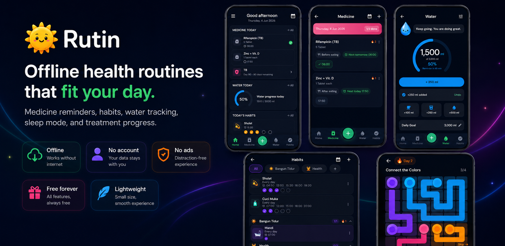
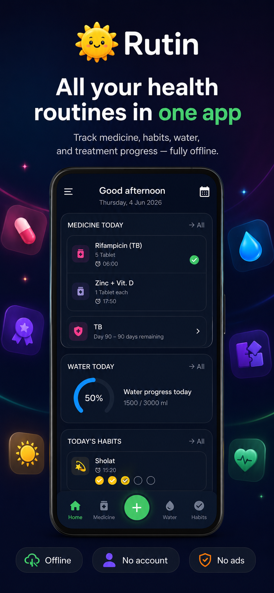
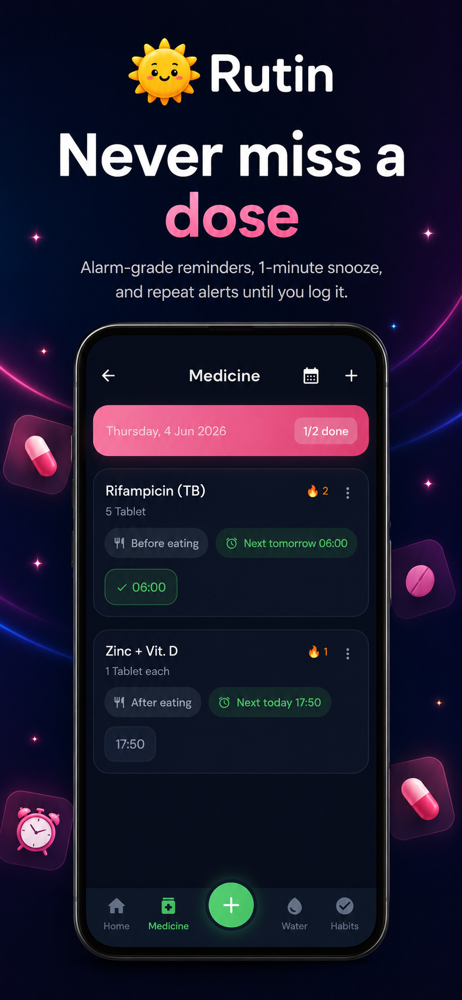
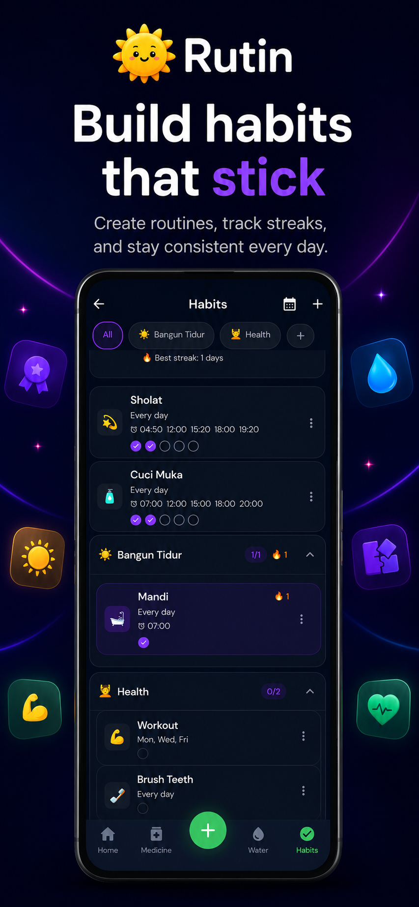
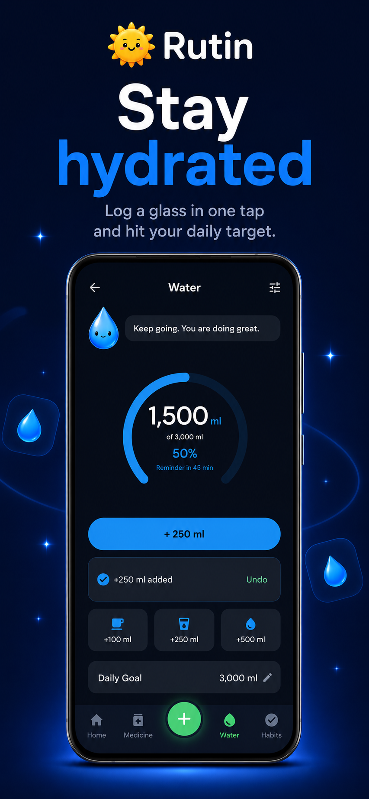
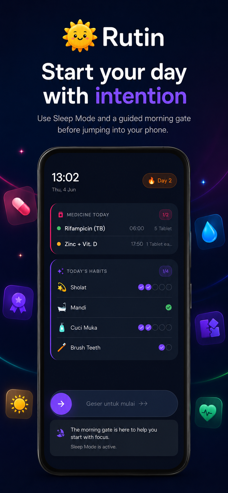
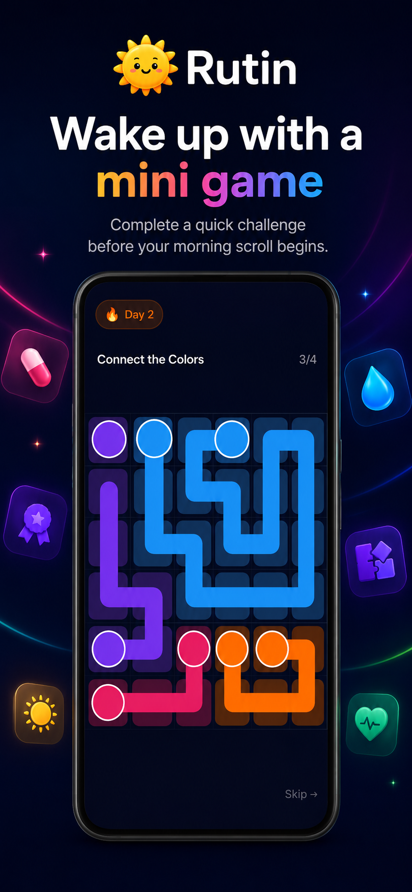

# Rutin — Daily Health Habits

> Built for myself. Useful for everyone.

A free, offline-first Android app for medicine reminders, hydration tracking, daily habits, and a morning wake-up routine. No account. No paywall. No internet required.

**Package:** `com.benihstudio.rutin` · Android · Flutter

---



| Home | Medicine | Habits | Water | Morning Gate | Wake-up Game |
|---|---|---|---|---|---|
|  |  |  |  |  |  |

---

## Why It Exists

I built Rutin while managing my own TB treatment. Taking medicine at exact times, every day, for 6+ months — a missed dose isn't just a bad habit, it can cause drug resistance. Every existing app I tried was either too generic, paywalled, or unreliable when it mattered most.

So I built the one I needed. Then I kept going, because the same problem applies to anyone trying to build consistent health habits.

---

## Features

### 💊 Medicine Reminders
Alarm-grade. Re-notifies every minute until confirmed taken. Full-screen takeover persistent even if the notification is dismissed. Supports multiple daily doses, food timing (before/after/with meals), snooze, and a monthly adherence calendar. Alarms survive reboots via `RECEIVE_BOOT_COMPLETED`.

### 💧 Water Tracking
Interval-based reminders within a configurable active window. Quick add/remove glass, WHO-based daily target, inline undo, and a live countdown to the next reminder.

### 🌟 Daily Habits
Multiple reminder times per habit. Per-reminder completion tracking. Streak tracking with partial-day survival — missing one reminder doesn't break a streak, missing the whole day does. Habit stacking: chain habits into routines with a shared stack streak. Calendar history per habit.

### 🌙 Sleep Mode + Morning Gate
A native Android foreground service detects sleep passively via screen-off timing. On unlock, a morning dashboard appears before the phone is usable — showing today's medicine and habits, then a randomly rotating wake-up game (Sequence Memory, Tap Rhythm, or Connect the Colors). An `AccessibilityService` prevents skipping the gate via the Home button.

### 🏥 Treatment Program
Track long-term treatment schedules — TB, Typhoid (Tifus), Malaria, ARV, chemotherapy, or any multi-week/multi-month medicine program. Day counter, adherence score, and PDF export via `printing` package.

### 🏅 Medals + Profile
Three auto-calculated personal records: Water Intake, Medicine Streak, Habit Streak. PR-only tracking — never resets on a streak break. Tappable medal cards with a detail sheet.

---

## Technical Highlights

**Alarm-grade notifications** — `NativeReminderScheduler.kt` uses `AlarmManager.setExactAndAllowWhileIdle` with sound-keyed notification channels. Channels are recreated on sound change (Android channels are immutable after first creation). Reminders re-arm automatically for the next day.

**Sleep detection without sensors** — `SleepModeService` sets `sleep_active` on screen-off after 10 minutes. No health permissions, no body sensors. Audio/video grace period: if playback is active, polls every 5 min via `AlarmManager`. Works on Android 13+ with the `FOREGROUND_SERVICE_SPECIAL_USE` type.

**Home button intercept** — `RutinAccessibilityService` keeps the morning gate on screen even if the user presses Home or switches apps, without blocking emergency calls or system UI.

**Sound-keyed notification channels** — each notification sound gets its own channel ID (e.g. `habit_reminder_chime`). Separate sound settings for medicine vs. habit alarms. Changing a sound deletes the old channel and creates a fresh one automatically.

**No build_runner** — Hive adapters are hand-written. Keeps the build fast and removes a fragile codegen step.

**Offline-first, always** — all data lives in Hive on-device. Sensitive boxes (`medicines`, `medicine_logs`, `tb_profiles`) are encrypted with `HiveAesCipher` + `flutter_secure_storage`. Firebase Analytics is the only network call, with no PII in event params.

---

## Tech Stack

| Layer | Choice |
|---|---|
| Framework | Flutter 3.44 (Dart) |
| State | flutter_riverpod |
| Storage | Hive (encrypted for sensitive data) |
| Alarms | AlarmManager via MethodChannel (Kotlin) |
| Notifications | flutter_local_notifications |
| Navigation | go_router |
| Analytics | Firebase Analytics |
| Sleep mode | AccessibilityService + foreground service (Kotlin) |
| Fonts | Bricolage Grotesque (display) + DM Sans (body) |

---

## Project Structure

```
lib/
  features/
    medicine/     # reminders, logs, history
    water/        # hydration goals, interval reminders
    habits/       # habit model, stacking, streaks, history
    home/         # today view combining all features
    sleep/        # sleep settings, morning gate, wake-up games
    settings/     # language, sounds, backup, about
    tb/           # treatment profile (TB, Tifus, Malaria, ARV, etc.), adherence, PDF export
    onboarding/   # 3-screen first-launch flow + permissions
    profile/      # medals, personal records, avatar
  core/           # theme, services, utilities
  l10n/           # ARB strings (Bahasa Indonesia + English)

android/app/src/main/kotlin/com/benihstudio/rutin/
  NativeReminderScheduler.kt   # medicine + habit alarm engine
  SleepModeService.kt          # sleep detection foreground service
  RutinAccessibilityService.kt # morning gate home-button intercept
  BootReceiver.kt              # alarm restore after reboot
  HabitAlarmReceiver.kt        # habit alarm firing + reschedule
  WaterAlarmReceiver.kt        # water reminder firing
  ReminderActivity.kt          # full-screen medicine alarm UI
```

---

## Status

**Internal testing on Play Store** — available via opt-in link. Working toward closed testing and production release.

All core features shipped and tested on a physical Android device (Infinix X6873, Android 13):
- Medicine reminders with full-screen alarm
- Water tracking with interval reminders
- Habit stacking and streaks
- Sleep mode with morning gate and 3 wake-up games
- TB/long-term treatment program
- Onboarding, coach marks tutorial, data backup
- Full Bahasa Indonesia + English localization

---

*Built by [Ilham Maulana Sulaeman](https://github.com/imsulaeman) — [Benih Studio](https://imsulaeman.me), Bandung, Indonesia.*
